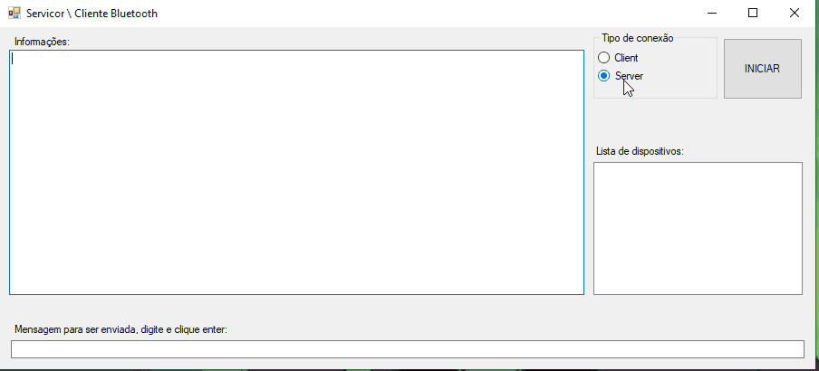
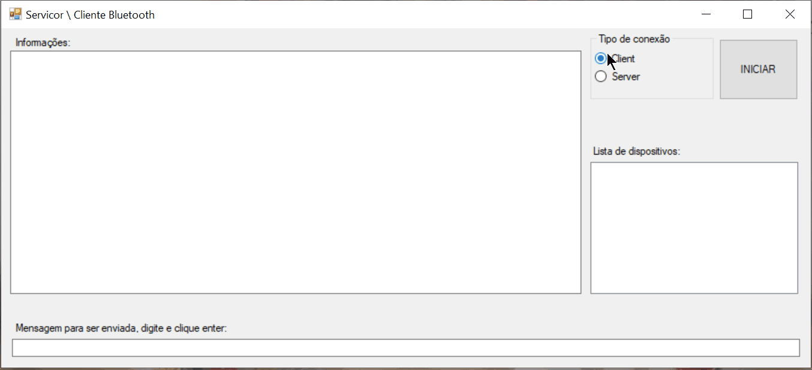

# Bluetooth.Chat
Protótipo de chat Bluetooth SSP (Serial Port Profile), cliente e servidor em uma mesma aplicação.
É um mini chat, onde ocorre a conxão entre um cliente e servidor, o envio e o recebimento de mensagens.
Windows Form Aplication feito em .Net Framework 4.

## Dependências
.Net Framework 4
InTheHand.Net.Personal

## Funcionanmento
Para utilizar é necessários dois computadores Windows com dispositivo Bluetooth.

##### Ativando servidor
- Abra o sistema;
- Selecione o time de conexão como “Server”;
- Clique no botão “INICIAR”.

##### Ativando cliente
- Abra o sistema;
- Selecione o time de conexão como “Client”;
- Clique no botão “INICIAR”;
- Na lista de dispositivos, dois cliques no dispositivo servidor;
- Autorize nos dispositovos (servidor e cliente) a conexão Bluetooth inciada (caso ainda não tenha ocorrido).

##### Enviando mensagens
- Digite a mensagem a ser enviada na caixa de texto inferior, tecle enter.

## Dificuldades do projeto
Existe pouca documentação sobre como utilizar as bibliotecas para a comunicação entre os dispositivos Bluetooth no Windows. Dos poucos exemplos encontrados, grande parte deles não funcionam corretamente.  

## Referencias usadas para a implementação
- https://inthehand.com/
- https://csharp.hotexamples.com/examples/InTheHand.Net.Sockets/BluetoothClient/Connect/php-bluetoothclient-connect-method-examples.html
- https://github.com/microsoft/Windows-universal-samples
- http://thejackal.blog.binusian.org/2011/03/16/simple-c-windows-bluetooth-chat-application-part-1-server-side/
- https://www.dropbox.com/sh/31o42beyy1y3gv1/AAAOFrIeyR50TJRDp2eTZAKNa/Bluetooth?dl=0&subfolder_nav_tracking=1
- https://www.youtube.com/watch?v=Jn05CU3mxzo
- https://www.youtube.com/watch?v=Xxnpq6ePQMk
- https://www.youtube.com/watch?v=jRD9-wM11P8
- https://www.youtube.com/watch?v=PxBB42dRDlg
- https://www.youtube.com/watch?v=8k2qcDP6x1c
- https://www.youtube.com/watch?v=9LG9Kfythu4
- https://www.serialio.com/faqs/whats-difference-between-bluetooth-le-and-bluetooth-spp-ble-vs-spp
